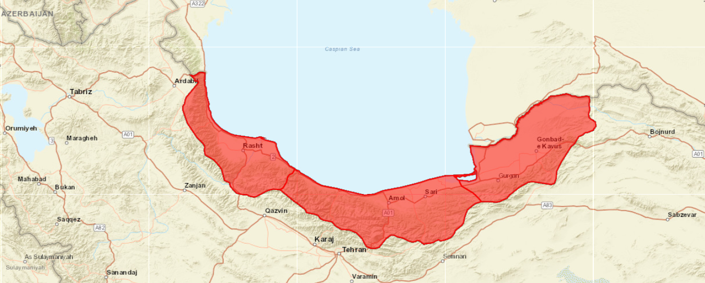
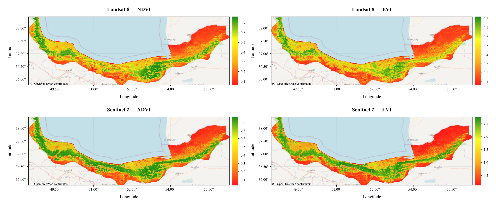

# Vegetation Index Comparison Using Landsat 8 and Sentinel-2  
### Caspian Provinces — Multi-Sensor Analysis & Visualization

This repository contains a complete Python workflow for computing, mosaicking, stretching, and visualizing vegetation indices from **Landsat 8 (OLI)** and **Sentinel-2 (MSI)** imagery across the **Caspian provinces of Iran**. 

The project includes:

- Multi-scene mosaicking to generate unified regional composites  
- Calculation of four vegetation indices: **NDVI, EVI, SAVI, MSAVI**  
- Percentile-based stretching (2–98%) for improved visualization  
- High-resolution comparison maps (2×2 panels) 
- Clean, replicable Python code 

---

##  Project Motivation
 
This project aims to:

- Demonstrate how different vegetation indices respond to the same landscape  
- Compare results from two widely used satellite sensors  
- Provide a clear educational example for students and practitioners in **remote sensing, GIS, environmental science, and agriculture**

---

##  Study Area  
The analysis focuses on the **Caspian provinces** of northern Iran — a region with diverse forests, croplands, and coastal ecosystems. The variability in vegetation makes it an ideal area for evaluating multi-sensor vegetation indices.

---

##  Satellites Used

### **Landsat 8 — Operational Land Imager (OLI)**
- 30 m resolution  
- Long-term scientific continuity (Landsat program)  
- Robust spectral response for vegetation monitoring  

### **Sentinel-2 — Multispectral Instrument (MSI)**
- 10–20 m resolution  
- Higher spatial detail  
- Dense revisit frequency (5 days with S2A/S2B)

---

##  Vegetation Indices Computed

### **1. NDVI — Normalized Difference Vegetation Index**
`NDVI = (NIR - RED) / (NIR + RED)`

- Most widely used vegetation index  
- Measures greenness, chlorophyll abundance, and canopy density  
- Range typically **–1 to +1**

### **2. EVI — Enhanced Vegetation Index**
`EVI = 2.5 × (NIR - RED) / (NIR + 6×RED - 7.5×BLUE + 1)`

- More sensitive than NDVI in dense vegetation  
- Reduces atmospheric and canopy background effects  
- Useful for humid and forested regions  

### **3. SAVI — Soil-Adjusted Vegetation Index**
`SAVI = (NIR - RED) / (NIR + RED + 0.5) × (1.5)`

- Corrects NDVI biases in sparsely vegetated or semi-arid landscapes  
- Reduces soil background interference  

### **4. MSAVI — Modified Soil-Adjusted Vegetation Index**
`MSAVI = (2 × NIR + 1 - sqrt((2 × NIR + 1)^2 - 8 × (NIR - RED))) / 2`

- Improved version of SAVI  
- Automatically adjusts for soil effects  
- Ideal for heterogeneous vegetation/soil regions  

---

## Workflow Summary

### **1. Data Preparation** 
- Load regional boundary shapefile
- Filter Landsat 8 & Sentinel-2 collections (2024 growing season)
- Apply cloud cover masking and geometric clipping

### **2. Vegetation Indices**
- Compute **NDVI, EVI, SAVI, MSAVI** 
- Generate **combination index** (average of all indices)
- Create median composites across time series

### **3. Data Export**
- Export median composites → **GeoTIFF format** 
- Transfer to local storage for processing
- Mosaic multiple tiles into unified rasters

### **4. Visualization**
- Apply **2–98% percentile stretching** for optimal contrast
- Overlay on **OpenStreetMap basemaps**
- Create **2×2 comparison panels** (Landsat vs Sentinel-2)

### **5. Analysis & Output**
- Produce multi-sensor comparison maps
- High-resolution PNG exports (300 DPI)

---

##  Comparison Results

